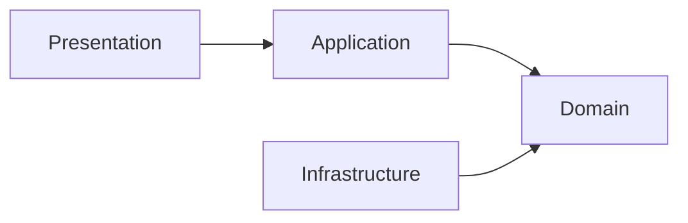

# Asobou API

Spring Boot backend API for Asobou, a platform for planning group
activities, coordinating participation, and sharing memories.

> [!NOTE]
> This project is in early development. APIs and domain models may change as
> the product evolves.

## Overview

Asobou helps groups turn ideas into shared activities. The backend is designed
to support the full activity lifecycle:

- organize groups and memberships;
- schedule activities and coordinate participation;
- preserve activity records, photos, and shared memories.

The codebase starts as a feature-oriented modular monolith. It applies
Domain-Driven Design principles where they make business rules explicit,
without introducing distributed-system complexity prematurely.

## Built With

| Area | Technologies |
| --- | --- |
| Runtime | Java 21, Spring Boot 4.1 |
| API | Spring MVC, Springdoc OpenAPI |
| Data | Spring Data JPA, MySQL 8.4, Flyway |
| Testing | JUnit, Testcontainers |
| Build and local development | Gradle, Docker Compose |

## Architecture

Packages are organized by business capability first and technical
responsibility second. The target package layout is:

```text
io.github.kimukenyuu.asobou
├── user/                 # Identity and profiles
│   ├── presentation/
│   ├── application/
│   ├── domain/
│   └── infrastructure/
│       ├── persistence/
│       └── integration/
├── group/                # Groups, memberships, and roles
│   ├── presentation/
│   ├── application/
│   ├── domain/
│   └── infrastructure/
│       ├── persistence/
│       └── integration/
├── asobi/                # Activities, schedules, tags, and participation
│   ├── presentation/
│   ├── application/
│   ├── domain/
│   └── infrastructure/
│       ├── persistence/
│       └── integration/
├── media/                # Photos and activity records
│   ├── presentation/
│   ├── application/
│   ├── domain/
│   └── infrastructure/
│       ├── persistence/
│       └── integration/
├── notification/         # Activity and participation notifications
│   ├── presentation/
│   ├── application/
│   ├── domain/
│   └── infrastructure/
│       ├── persistence/
│       └── integration/
└── shared/               # Cross-cutting code with no feature owner
    ├── presentation/
    └── config/
```

Packages are created only when a feature needs them; empty layers are not
added in advance.

The arrows below show source-code dependencies, not runtime request flow:



- `presentation` owns HTTP contracts, validation, controllers, and responses.
- `application` coordinates use cases and transaction boundaries.
- `domain` contains business concepts, state, rules, and repository contracts.
- `infrastructure.persistence` implements repository contracts with JPA.
- `infrastructure.integration` implements external system adapters.
- `shared` contains only cross-cutting code with no clear feature owner.

Domain models remain independent of Spring MVC, JPA, MySQL, and external SDKs.

### Domain-Driven Design

The project uses Domain-Driven Design to keep business behavior at the center
of the codebase:

- domain models express business state and invariants;
- value objects represent concepts that require domain-specific validation;
- application services coordinate use cases without owning domain rules;
- repository interfaces belong to the domain, while JPA adapters belong to
  `infrastructure.persistence`;
- domain models and JPA entities are separated so database concerns do not
  shape the business model;
- package boundaries follow business capabilities rather than global
  controller, service, and entity folders.

DDD is applied pragmatically. New abstractions and package layers are
introduced only when the domain or an external dependency requires them.

### Deployment Infrastructure

Cloud infrastructure will be maintained separately in the `asobou-infra`
repository. Feature-level `infrastructure.integration` packages contain
adapters for external systems; they do not contain AWS CDK deployment
definitions.

```text
asobou-api/               # Application and domain code
asobou-infra/             # AWS CDK and deployment infrastructure
```

## Getting Started

### Prerequisites

- JDK 21
- A Docker-compatible runtime

The Gradle Wrapper is included, so a separate Gradle installation is not
required.

### 1. Configure the local environment

```bash
cp .env.example .env
```

Update the values in `.env` for your local database. The file is excluded from
Git and must not be committed.

### 2. Start MySQL

```bash
docker compose up -d mysql
```

Wait until the container reports a healthy status:

```bash
docker compose ps
```

### 3. Run the application

```bash
./gradlew bootRun
```

The application listens on port `8080` by default.

### 4. Explore the API

With the application running, use the following endpoints:

| Resource | Endpoint |
| --- | --- |
| Swagger UI | `/swagger-ui.html` |
| OpenAPI document | `/v3/api-docs` |
| Health check | `/actuator/health` |

## Testing

Run the complete test suite:

```bash
./gradlew test
```

Integration tests start an isolated MySQL container through Testcontainers.
The development database does not need to be running for these tests.
